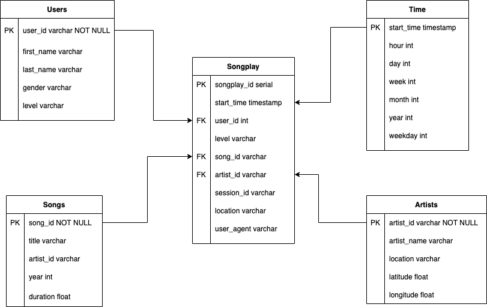

# Project Datawarehouse

## Goals

A music streaming startup, Sparkify, has grown their user base and song database and want to move their processes and data onto the cloud. Their data resides in S3.

As their data engineer, I'm tasked with building an ETL pipeline that extracts their data from S3, stages them in Redshift, and transforms data into a set of dimensional tables for their analytics team to continue finding insights in what songs their users are listening to. You'll be able to test your database and ETL pipeline by running queries given to you by the analytics team from Sparkify and compare your results with their expected results.

## Design of Dimensional Tables for Song Play Analysis
Using the song and event log datasets, we will need to create a star schema optimized for queries on song play analysis in the Redshift cluster. This includes the following tables.

* Fact Table

	1. 	songplays - records in event data associated with song plays i.e. records with page NextSong

* Dimension Tables

	1. users - users in the app
	user_id, first_name, last_name, gender, level
	2. songs - songs in music database
	song_id, title, artist_id, year, duration
	3. artists - artists in music database
	artist_id, name, location, lattitude, longitude
	4. time - timestamps of records in songplays broken down into specific units
	start_time, hour, day, week, month, year, weekday

## Files Included in the REPO:

* create_table.py is where you'll create your fact and dimension tables for the star schema in Redshift.
* etl.py is where you'll load data from S3 into staging tables on Redshift and then process that data into your analytics tables on Redshift.
* sql_queries.py is where you'll define your SQL statements, which will be imported into the two other files above.
* ExampleAnalysis.ipynb is where you can test OLAP task intance.

## Steps to run the projects:

1. Execute the "python create_tables.py" file in the Terminal to create the staging tables and analytical tables in Redshift.
2. Execute the "python etl.py" file in the Terminal to copy data that resides in S3 as JSON file to the staging table in Redshift.
3. Test analytical query to Redshift cluster on ExampleAnalysis.ipynb.

## Sample query
Below is an example query of OLAP like purpose, which you can test it on .
### How many songs were played on each day of the week?
	SELECT t.weekday, COUNT(p.songplay_id) as num_songplayed
	FROM songplay p
	JOIN time t ON (p.start_time = t.start_time)
	GROUP BY t.weekday
	ORDER BY 2 DESC;
	
After executing, you get the results of the numbaer of songs played on each day of the week by descending order.